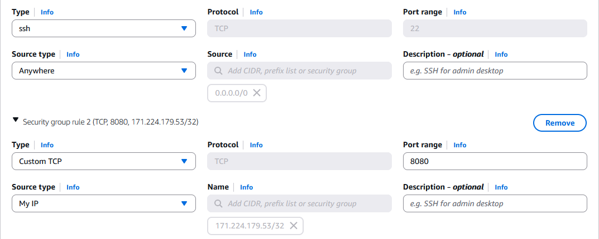
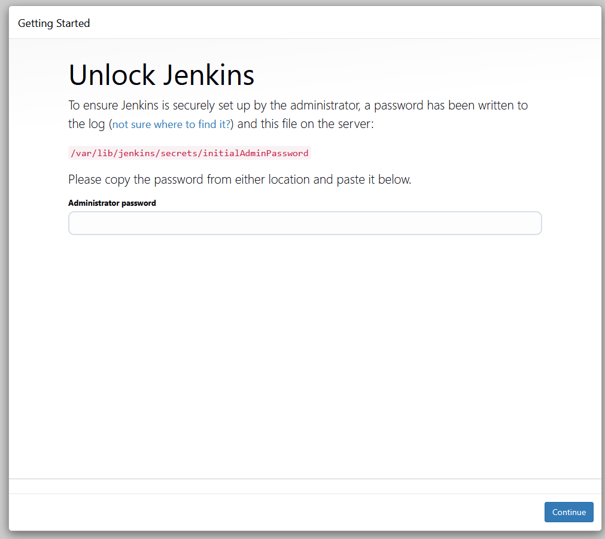
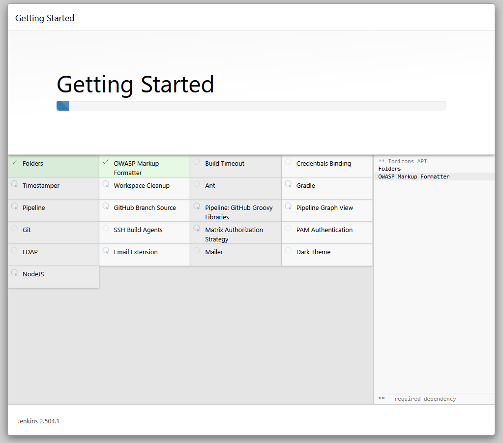
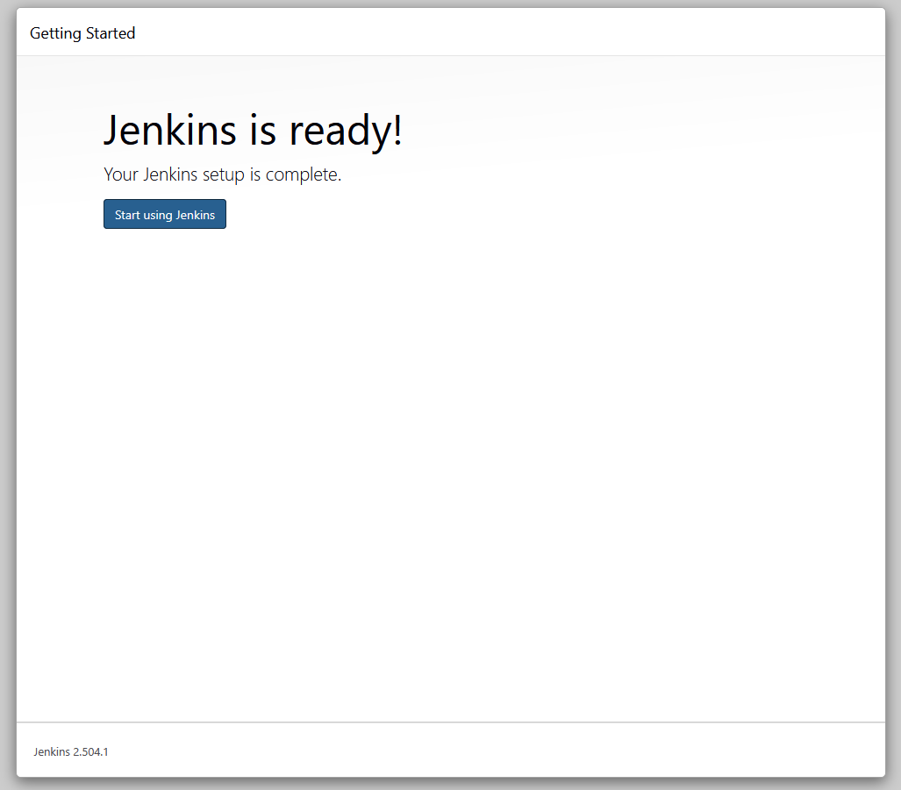
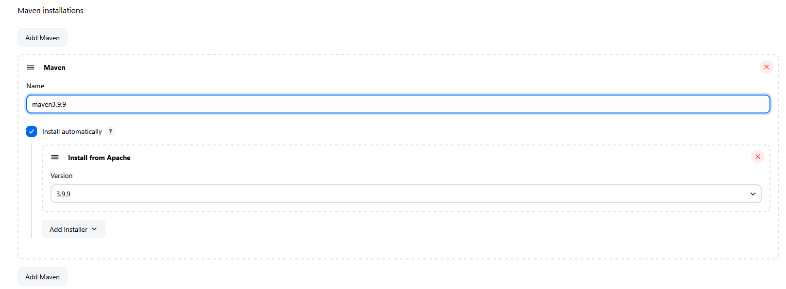
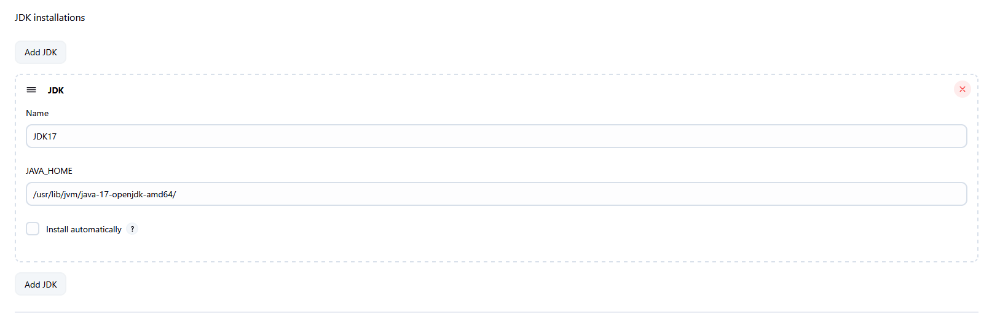

# Setup-CICD-By-Using-Jenkins-Nexus-Sonarqube-Docker-and-ECS
Project Level

## 1. Create EC2 Server for Jenkins

#### 1.1 User Data Script for Jenkins

```
sudo apt-get update

sudo apt-get install openjdk-21-jdk -y

sudo wget -O /etc/apt/keyrings/jenkins-keyring.asc \
  https://pkg.jenkins.io/debian-stable/jenkins.io-2023.key

echo "deb [signed-by=/etc/apt/keyrings/jenkins-keyring.asc]" \
  https://pkg.jenkins.io/debian-stable binary/ | sudo tee \
  /etc/apt/sources.list.d/jenkins.list > /dev/null

sudo apt-get update

sudo apt-get install jenkins -y
```


#### 1.2 Use 80 and 8080 for Security Group




#### 1.3 Default Jenkins Path

```
ls /var/lib/jenkins/
```

#### 1.4 Secret Path

- Type EC2's public Ip:8080



```
cat /var/lib/jenkins/secrets/initialAdminPassword
```

#### 1.5 Install Plugin






#### 1.6 Install Maven and JDK






## 2. Create EC2 Server for Nexus