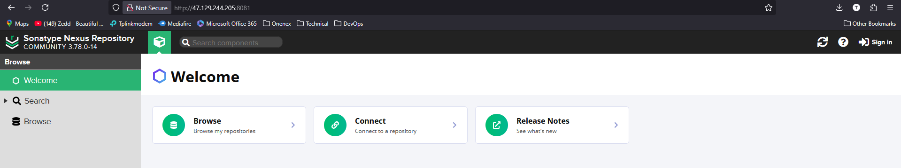
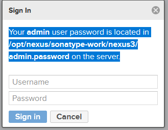
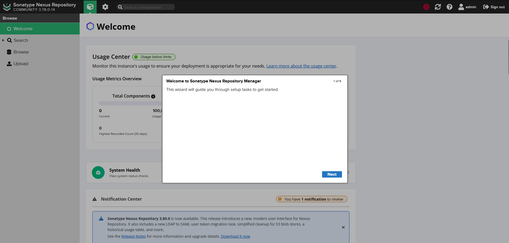
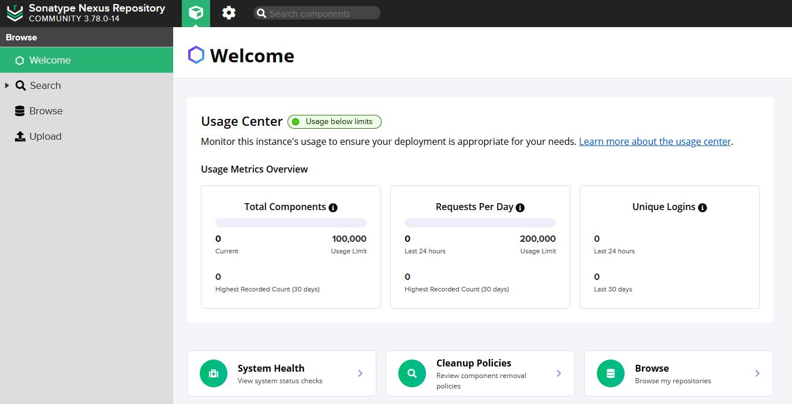
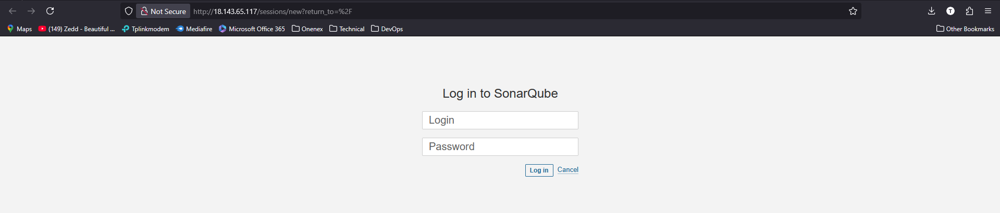
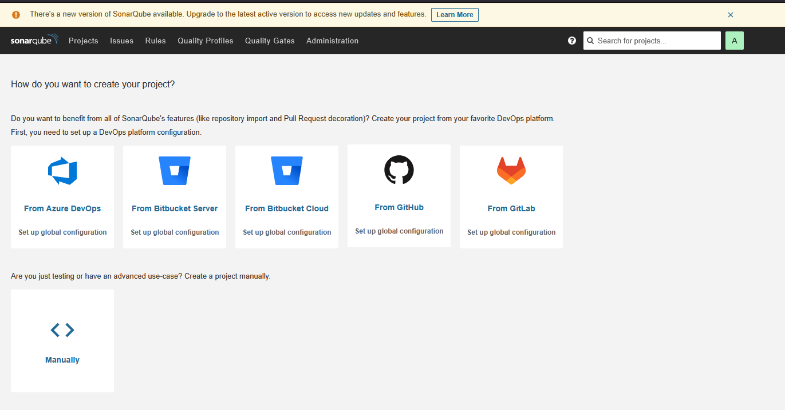

# Setup-CICD-By-Using-Jenkins-Nexus-Sonarqube-Docker-and-ECS
Project Level

## 1. Create EC2 Server for Jenkins

#### 1.1 User Data Script for Jenkins

```
sudo apt-get update

sudo apt-get install openjdk-21-jdk -y

sudo wget -O /etc/apt/keyrings/jenkins-keyring.asc \
  https://pkg.jenkins.io/debian-stable/jenkins.io-2023.key

echo "deb [signed-by=/etc/apt/keyrings/jenkins-keyring.asc]" \
  https://pkg.jenkins.io/debian-stable binary/ | sudo tee \
  /etc/apt/sources.list.d/jenkins.list > /dev/null

sudo apt-get update

sudo apt-get install jenkins -y
```


#### 1.2 Use 80 and 8080 for Security Group


#### 1.3 Default Jenkins Path

```
ls /var/lib/jenkins/
```

#### 1.4 Secret Path

- Type EC2's public Ip:8080


```
cat /var/lib/jenkins/secrets/initialAdminPassword
```

#### 1.5 Install Plugin


#### 1.6 Install Maven and JDK


## 2. Create EC2 Server for Nexus and Sonarqube

#### 2.1 User Data Script for Nexus

- Use nexus-setup.sh

#### 2.2 Security Group for Nexus

- Allow ssh from your ip
- Allow 8081 from your ip
- Allow 8081 from jenkins-sg

#### 2.3 User Data Script for Nexus

- Use sonar-setup.sh

#### 2.4 Security Group for Nexus

- Allow ssh from your ip
- Allow 80 from your ip
- Allow 80 from jenkins-sg

#### 2.5 Check nexus status

- Log in to nexus EC2 and run

```
systemctl status nexus
ls /opt/nexus/
java -v
```

- Log in to publicip:8081



- Click Sign In



```
cat /opt/nexus/sonatype-work/nexus3/admin.password
```

- Log in and Set Up





#### 2.6 Check sonarqube status

- Log in to publicip






- Allow 8080 from Sonarqube SG at Jenkin SG