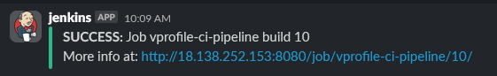

# Setup-CICD-By-Using-Jenkins-Nexus-Sonarqube-Docker-and-ECS
Project Level

## 1. Create EC2 Server for Jenkins

#### 1.1 User Data Script for Jenkins

```
sudo apt-get update

sudo apt-get install openjdk-21-jdk -y

sudo wget -O /etc/apt/keyrings/jenkins-keyring.asc \
  https://pkg.jenkins.io/debian-stable/jenkins.io-2023.key

echo "deb [signed-by=/etc/apt/keyrings/jenkins-keyring.asc]" \
  https://pkg.jenkins.io/debian-stable binary/ | sudo tee \
  /etc/apt/sources.list.d/jenkins.list > /dev/null

sudo apt-get update

sudo apt-get install jenkins -y
```


#### 1.2 Use 80 and 8080 for Security Group


#### 1.3 Default Jenkins Path

```
ls /var/lib/jenkins/
```

#### 1.4 Secret Path

- Type EC2's public Ip:8080


```
cat /var/lib/jenkins/secrets/initialAdminPassword
```

#### 1.5 Install Plugin


#### 1.6 Install Maven and JDK


## 2. Create EC2 Server for Nexus and Sonarqube

#### 2.1 User Data Script for Nexus

- Use nexus-setup.sh

#### 2.2 Security Group for Nexus

- Allow ssh from your ip
- Allow 8081 from your ip
- Allow 8081 from jenkins-sg
- Allow 80 from anywhere

#### 2.3 User Data Script for Nexus

- Use sonar-setup.sh

#### 2.4 Security Group for Nexus

- Allow ssh from your ip
- Allow 80 from your ip
- Allow 80 from jenkins-sg

#### 2.5 Check nexus status

- Log in to nexus EC2 and run

```
systemctl status nexus
ls /opt/nexus/
java -v
```

- Log in to publicip:8081


- Click Sign In


```
cat /opt/nexus/sonatype-work/nexus3/admin.password
```

- Log in and Set Up


#### 2.6 Check sonarqube status

- Log in to publicip


- Allow 8080 from Sonarqube SG at Jenkin SG

#### 2.7 Incase of if you can't log in Jenkin Url

- You can change it here

```
sudo vim /var/lib/jenkins/jenkins.model.JenkinsLocationConfiguration.xml
sudo systemctl restart jenkins.service
```


## 3 Install Plugin in Jenkins Server

#### 3.1 Install Nexus Artifact Uploader, SonarQube Scanner, Build Timestamp, Pipeline Maven Integration, Pipeline Utility Steps Version


## 4 First Pipeline

#### 4.1 Create Pipeline by using Jenkinsfile

- Click New Item


- Choost Pipeline and Click OK


- Insert Data from Jenkinsfile and Click Save


- Click Build Now


- Click Status


## 5 Add SonarQube Scanner and SonarQube Servers Detail

#### 5.1 Add SonarQube Scanner


#### 5.2 Add SonarQube Servers

- Create Token from SonarQube


## 6. Code Analysis Demonstration

#### 6.1 Use New Jenkinsfile Information and Run Pipeline


#### 6.2 Use New Jenkinsfile Information and Run Pipeline


## 7. How To Create Quality Gates at sonarQube

#### 7.1 Add Quality Gates

1. Click Quality Gates
2. Click Create
3. Click Add Condition


#### 7.2 Update Default Quality Gates with New Quality Gates

1. Go to vprofile project
2. Project Settings
3. Quality Gates
4. Choose vprofile-QG


#### 7.3 Create Webhook

1. Go to vprofile project
2. Project Settings
3. Webhooks
4. Name must be your jenkien server private ip:8080/sonarqube-webhook


#### 7.4 Use New Jenkinsfile Information and Run Pipeline


## 8 Nexus Repository 

#### 8.1 Create Nexus Repository for Maven Hosted


#### 8.2 Create Credential


#### 8.3 Use New Jenkinsfile Information and Run Pipeline


## 9 Add Notification Slack to Jenkins

## 9.1 Install Plugin


## 9.2 Create Workplace from Slack

- Create workplace from Slack 


- Create New Channel from Workplace


## 9.3 Add Jenkins to Slack

- Search Add app slack from browser and click this link, you will see like this


- Copy Token to somewhere


- Click Down Arrow and Click Workspace


- Copy url to somewhere


-  Go to Jenkin Dashboard > Manage Jenkins > System
- Add Workspace Name
- Add Credentials
- Add Channel Name
- Click Test Connection


- Check in Workspace


#### 9.4 Use New Jenkinsfile Information and Run Pipeline





## 10 Add Docker and ECR

#### 10.1 Install aws-cli to Jenkins Server

```
sudo apt update
sudo apt install unzip curl -y
curl "https://awscli.amazonaws.com/awscli-exe-linux-x86_64.zip" -o "awscliv2.zip"
unzip awscliv2.zip
sudo ./aws/install
aws --version
```


#### 10.2 Install docker engine to Jenkins Server

```
# Add Docker's official GPG key:
sudo apt-get update
sudo apt-get install ca-certificates curl
sudo install -m 0755 -d /etc/apt/keyrings
sudo curl -fsSL https://download.docker.com/linux/ubuntu/gpg -o /etc/apt/keyrings/docker.asc
sudo chmod a+r /etc/apt/keyrings/docker.asc

# Add the repository to Apt sources:
echo \
  "deb [arch=$(dpkg --print-architecture) signed-by=/etc/apt/keyrings/docker.asc] https://download.docker.com/linux/ubuntu \
  $(. /etc/os-release && echo "${UBUNTU_CODENAME:-$VERSION_CODENAME}") stable" | \
  sudo tee /etc/apt/sources.list.d/docker.list > /dev/null
sudo apt-get update

# To install latest version

sudo apt-get install docker-ce docker-ce-cli containerd.io docker-buildx-plugin docker-compose-plugin -y
```


```
su - i jenkins
exit
usermod -a -G docker jenkins
id jenkins
reboot
```


#### 10.3 Create IAM And Create ECR 

- Create IAM User with these permission


- Create ECR


#### 10.4 Install Plugin

Amazon Web Services SDK :: All
Amazon ECR
Docker Pipeline
CloudBees Docker Build and Publish 


#### 10.5 Add Credentials to Jenkins

Go to

    Dashboard
    Manage Jenkins
    Credentials
    System
    Global credentials (unrestricted)


#### 10.6 Use New Jenkinsfile Information and Run Pipeline


## 11 Install Plugin,create ECS Cluster and ECS Services


#### 11.1 Create ECS Cluster and ECS Services


- Add this role to ecsTaskExecutionRole


- Create Service


- Use public subnets from networking


- Wait for until finished set up.

- Call DNS 

Amazon Elastic Container Service
Clusters
vprofile
Services
vprofileappsvc
Configuration


#### 11.2 Install Plugins

Pipeline: AWS Steps


#### 11.3 Use New Jenkinsfile Information and Run Pipeline


